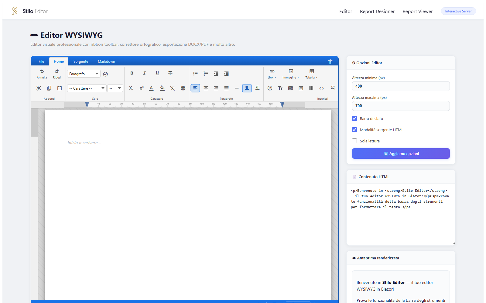
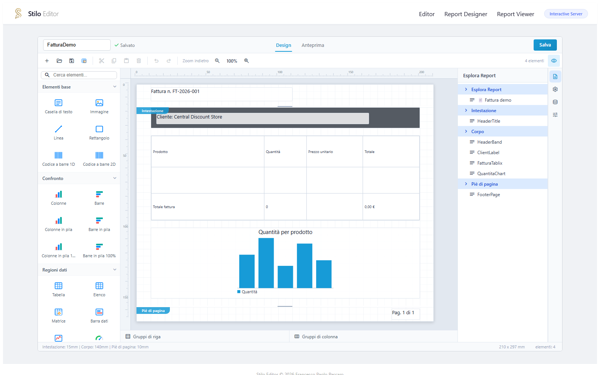
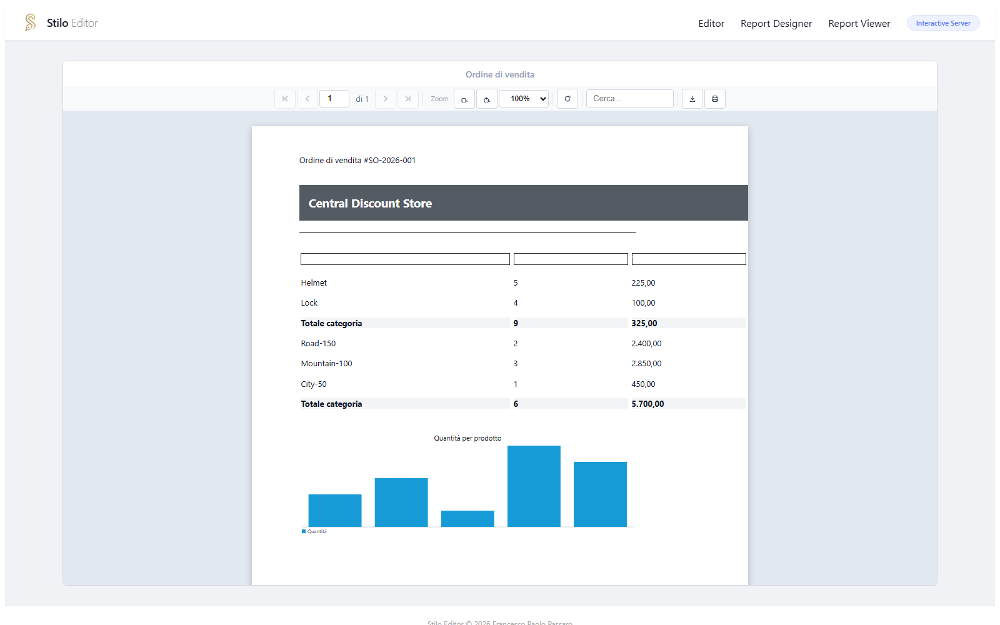

# Stilo Suite


**Live demo projects for the Stilo suite** — a family of professional, 100% managed-code .NET libraries for Blazor: a WYSIWYG HTML editor, an RDL/RDLC-compatible report designer/viewer, a document conversion engine, and an offline spell checker.

This repository contains two runnable sample apps (Blazor Server / Interactive and Blazor WebAssembly) that consume the official **NuGet packages** — no project references to source code, no DLLs to copy by hand.

---

## 🆓 Free license for developers

Every Stilo package requires a license key at runtime. **Individual developers can get a free annual license** — no cost, no credit card, renewable every year.

👉 **[Get your free license at digitalsolutions.it/stilo/license](https://www.digitalsolutions.it/stilo/license)**

Commercial/production use beyond the free tier requires a separate commercial license — see [Licensing](#licensing) below.

---

## Screenshots

### Stilo.Editor — WYSIWYG HTML editor


### Stilo.Reports — Report Designer


### Stilo.Reports — Report Viewer


---

## The Stilo suite

| Package | NuGet | Description |
|---|---|---|
| **Stilo.Editor** | [](https://www.nuget.org/packages/Stilo.Editor) | Office-style WYSIWYG HTML editor for Blazor: ribbon toolbar, pages mode, image/table editing, Markdown mode, autosave, dark theme, and more. |
| **Stilo.Reports** | [](https://www.nuget.org/packages/Stilo.Reports) | Self-contained, RDL/RDLC-compatible report designer and viewer: drag-and-drop designer, Tablix (table/list/matrix), charts, barcodes/QR, PDF export. |
| **Stilo.Documents** | [](https://www.nuget.org/packages/Stilo.Documents) | Document conversion engine: DOCX import/export, HTML→PDF rendering, Markdown conversion, barcode/QR generation and decoding. |
| **Stilo.Maestro** | [](https://www.nuget.org/packages/Stilo.Maestro) | Pure C# offline spell-checking engine, multilingual, zero JS dependency. |

All four packages are **100% managed C#** — no native binaries, no external services, works in both Blazor Server and Blazor WebAssembly.

Full documentation and source code: **[Stilo.Sources](https://github.com/francescopaolopassaro/Stilo.Sources)**.

---

## Features, in detail

Everything below ships in the current release of each package — nothing here is planned/roadmap. Current versions: `Stilo.Editor` **1.0.1**, `Stilo.Reports`/`Stilo.Documents`/`Stilo.Maestro` **1.0.0**.

### Stilo.Editor — every button and action, explained

The ribbon is organized in tabs (**File**, **Home**, **Source**, **Markdown**); the **Home** tab is grouped exactly as below. Every entry is a real, working button in `1.0.1` — none of this is planned.

#### File tab
| Button | What it does |
|---|---|
| **New** | Clears the document back to an empty page (asks nothing — the host app decides via `OnSave`/autosave whether to persist the previous content first). |
| **Open ▾** | Flyout with 4 import options: **Word (Docx)**, **PDF**, **Markdown**, **HTML** — each opens a native file picker; Docx/PDF import go through the `Stilo.Documents` converters you wired up (`OnOpenDocxFile`/`OnOpenPdfFile`), Markdown/HTML are parsed client-side. |
| **Save ▾** | Flyout with 4 export targets: **HTML**, **Word (Docx)**, **PDF**, **Markdown**. Which one is the *default* one-click action is set by `PreferredSaveFormat`. Raises `OnSave` with the chosen format and current HTML — the host decides what "save" means (download, API call, …). |

#### Home tab — Clipboard group
| Button | Shortcut | What it does |
|---|---|---|
| **Undo** | Ctrl+Z | Steps back through the browser's native undo stack. |
| **Redo** | Ctrl+Y | Steps forward again. |
| **Cut** | Ctrl+X | Removes the selection and puts it on the clipboard. |
| **Copy** | Ctrl+C | Copies the selection to the clipboard. |
| **Paste** | Ctrl+V | Pastes clipboard content; if it comes from Word/Excel/Google Docs, proprietary markup (`mso-*`, `w:`, `v:`, Google `data-*`/docs-id attributes) is stripped automatically and Word lists are converted to real `<li>` elements. |

#### Home tab — Style / Font group
| Control | What it does |
|---|---|
| **Paragraph style** dropdown | Switch the current block between Paragraph, Heading 1–6, Blockquote, Code. |
| **Style presets** dropdown | One-click styles: Small text, Large text, Inline code, Marker, Subtle, Callout, Title, Subtitle. |
| **Font** dropdown | Applies a font-family to the selection; the list comes from `EditorOptions.FontFamilies` (10 common fonts by default, fully overridable). |
| **Size** dropdown | Applies a font size; list from `EditorOptions.FontSizes` (16 sizes, 8–72 by default). |
| **Bold** (Ctrl+B) / **Italic** (Ctrl+I) / **Underline** (Ctrl+U) / **Strikethrough** | Standard inline formatting toggles. |
| **Subscript** / **Superscript** | Toggle sub/superscript on the selection. |
| **Text color** picker | Opens a color palette + custom color input, applies as foreground color. |
| **Highlight** picker | Same, applied as background/highlight color. |
| **Remove formatting** | Strips all inline formatting from the selection, back to plain text. |
| **Text language** flyout | Wraps the selection in a `lang="…" dir="…"` span (24 languages, e.g. Arabic/Hebrew auto-suggest RTL) — used for WCAG-correct screen-reader pronunciation in mixed-language documents; includes explicit **LTR**/**RTL** override buttons and a **No language** (clear) action. |

#### Home tab — Paragraph group
| Button | What it does |
|---|---|
| **Bullet list** / **Numbered list** | Toggle the current block into a `<ul>`/`<ol>` list item. |
| **Decrease indent** / **Increase indent** | Outdent/indent the current list item or block. |
| **Align left / center / right / justify** | Paragraph alignment, one button per option, shows which one is active. |
| **Horizontal line** | Inserts an `<hr>` at the cursor. |
| **Left to right** / **Right to left** | Sets the *whole document's* base text direction (not just the selection — for that, see "Text language" above). |

#### Home tab — Insert group
| Button | What it does |
|---|---|
| **Link ▾** | Flyout: URL, display text, and open-in (same window / new window) — inserts or edits a hyperlink on the selection. |
| **Image ▾** | Flyout with two tabs: **From file** (upload, shows a loading state, then a live preview before inserting) and **From URL** (paste an image URL, live preview); plus alt-text field. |
| **Table ▾** | Visual grid picker (drag to choose rows × columns) with 7 style presets (Classic Word, Light, Dark, Colorful, Minimal, Grid, Plain) split into "Featured" and "Other" sections; optional header row toggle. |
| **Insert emoji** | Categorized emoji picker, inserts at the cursor. |
| **Special characters** | Categorized picker for symbols/characters not on a standard keyboard (©, §, √, arrows, …). |
| **Insert iframe** | Embeds an external page/widget by URL. |
| **Insert template** | Opens a gallery of reusable content blocks/document templates. |
| **Insert barcode** | Opens the barcode/QR generator dialog — see the [dedicated section](#barcodes--qr-codes-what-stilodocumentsbars-handles) below. |
| **Insert HTML** | Flyout with a raw-HTML textarea plus a live sandboxed iframe preview before inserting. |
| **Find and replace** | Flyout: find text (with "match case"), find-next, replace one, replace all, shows a "no matches" / "{n} replacements made" status. |
| **Insert code** | Flyout: pick a language, paste code, live-inserts as a formatted code block. |
| **Insert LaTeX formula** | Flyout with a formula input and a live rendered preview before inserting (e.g. `E=mc^2`, `\frac{a}{b}`, `\sum_{i=1}^n i^2`). |
| **Insert bookmark** | Prompts for a bookmark name and marks the cursor position for later linking/navigation. |
| **Page break** | Inserts a visual page-break marker (`<div class="se-page-break">`). |

#### Home tab — Page group
| Button | What it does |
|---|---|
| **Portrait** / **Landscape** | Toggles page orientation in Pages mode. |
| **Paper format ▾** | Flyout to pick A4, A3, A5, Letter, Legal, or Tabloid. |

#### Home tab — View group
| Button | What it does |
|---|---|
| **Zoom out** / **zoom level** / **Zoom in** | Steps zoom down/up in the 25%–200% range; clicking the percentage itself resets to 100%. |
| **Page mode** | Toggles Pages mode — an A4 sheet view with horizontal and vertical millimeter rulers. |
| **Show blocks** | Toggles visible outlines around block-level elements (paragraphs, divs, …), like formatting marks. |
| **Print preview** | Opens the browser's native print dialog against a print-formatted view of the content. |
| **Full screen** | Expands the editor to fill the viewport (Esc to exit). |
| **Dark theme** | Toggles a dark color scheme for the editor UI and canvas. |
| **Minimap** | Toggles a collapsible sidebar with a scaled-down clone of the content, a viewport indicator, and click-to-navigate; updates live as you type. |

#### Home tab — Spell check group *(requires `Stilo.Maestro` registered)*
| Control | What it does |
|---|---|
| **ON/OFF toggle** | Enables/disables inline spell checking; the group itself only appears once Maestro's dictionaries finish loading. |
| **Dictionary language** dropdown | Switch the active dictionary (Italian, English US/UK, German, French, Spanish). |
| *(on a misspelled word)* click → popup | Suggestion list; **Ignore** (skip this instance) and **Add to dictionary** (persist to the personal/user dictionary) actions. |

#### Home tab — Restricted editing group
| Button | What it does |
|---|---|
| **Lock selected content** | Wraps the current selection in a non-editable (`contentEditable=false`) region — for template documents where only certain areas should stay editable. |
| **Unlock selected region** | Removes the lock from a previously locked region. |
| **Show/hide locked regions** | Toggles a visual indicator (lock icon) over locked regions so authors can see them at a glance. |

#### Contextual object toolbar
Appears automatically when you select an **image** or a **table cell** — it floats next to the selection.

*Image toolbar*: **Wrap left** / **Inline** / **Wrap right** (positioning) · quick resize presets **Small / Medium / Large / Original** · **Filters** flyout: Grayscale, Sepia, Brightness, Contrast, Remove background, Rotate left/right, Flip horizontal/vertical · **Caption** (toggle a caption bar under the image) · **Replace image** (swap the source, keep position/size) · **Link** (make the image clickable) · **Delete image**.

*Table toolbar*: **Insert row above/below**, **Insert column left/right**, **Delete row**, **Delete column**, **Merge cells**, **Split cell**, **Delete table**, border presets **All borders / No borders / Outer borders**, table alignment **Left / Center / Right**. Column widths can also be resized directly by dragging the column border in the canvas.

#### Source & Markdown tabs
- **Source** tab — a raw HTML textarea; an **Apply** button commits the edited HTML back to the visual view.
- **Markdown** tab — same idea, editing the document as GitHub-Flavored Markdown; **Apply** converts it back to HTML.

#### Status bar
Current format block · font name/size · paper format · orientation (P/L) · zoom level · live word/character count · autosave status ("Saving…" / "Saved" / error, shown only if `AutoSaveCallback` is set) · **Keyboard shortcuts** button (opens the accessibility dialog: shortcut reference, a **Hover to speak** text-to-speech toggle, a **Magnifier** toggle, and speech rate/pitch sliders) · UI language selector (ribbon, dialogs and status bar are fully localized).

#### Zero manual asset wiring
`StiloEditor` is fully self-contained: CSS and JavaScript are embedded resources the component injects into the page itself at runtime. No `<link>`/`<script>` tags, no `<HeadOutlet>`, no static-assets base path to configure — register the service and drop the component.

---

### Stilo.Reports — every toolbar action and panel, explained

#### Top toolbar
| Button | What it does |
|---|---|
| **New** | Replaces the current report with a blank one. |
| **Open** | Native file picker for `.rdl`/`.rdlc` files; the reader tolerates RDL 2008/2010/2016 namespace variants and typical Visual Studio/SSDT authoring quirks. Shows an error dialog on invalid/corrupted XML. |
| **Save** | Downloads the current report as `.rdlc` (also available as the big **Save** button in the header, next to the report-name field and a "Saved" indicator). |
| **Label sheet** | Opens the [label sheet wizard](#label-sheet-wizard) (see below). |
| **Cut** / **Copy** / **Paste** | Clipboard operations on the currently selected item(s); disabled when there's nothing selected/on the clipboard. |
| **Delete** | Removes the selected item(s) from the report body. |
| **Undo** / **Redo** | Full undo/redo stack over designer edits. |
| **Zoom out** / **Zoom in** | Scales the design canvas. |
| **Design / Preview** tabs | Switch between the editing surface and an embedded live preview backed by the real `StiloReportViewer` (using `PreviewDataSources`, or auto-generated mock rows per dataset if you didn't supply any). |

#### Toolbox (searchable, drag-and-drop onto the canvas)
| Group | Items |
|---|---|
| **Basic items** | Text box, Image, Line, Rectangle, 1D Barcode, 2D Barcode. |
| **Comparison** | Column, Bar, Stacked Column, Stacked Bar, Stacked Column 100%, Stacked Bar 100% charts. |
| **Data regions** | Table, List, Matrix, Data Bar, Sparkline, Indicator. |
| **Distribution** | Area, Line, Pie, Scatter charts. |
| **Sub reports** | SubReport. |
| **Shapes** | Shape (generic positionable rectangle/box). |

#### Side panels (toggled from the icon rail)
| Panel | What it does |
|---|---|
| **Report Explorer** | Tree view of the report structure (header/body/footer, every named item) for quick navigation and selection. |
| **Properties** | Contextual property grid for the selected item — categories: General (name/position/size/Z-index), Appearance (colors, borders), Text (font, alignment, format), Image, Barcode (symbology, value, show text, bar color), Chart (type, series, legend, category expression), Subreport (report name, parameters), Indicator/Data Bar/Sparkline (min/max, thresholds), Order (**Bring to front**, **Bring forward**, **Send backward**, **Send to back**). |
| **Data** | Manage data sources and datasets; per-dataset field list with a "refresh fields from preview data source" action; **+ Add Data Source** / **+ Add Data Set** buttons. |
| **Parameters** | Manage `Report.Parameters`: **+ Add parameter**, per-parameter type/prompt/default & valid values, and **Nullable**/**Allow blank**/**Multi-value**/**Hidden** flags. |

#### Selection & editing
- **Multi-selection** — click with modifier or drag a marquee; the toolbar shows "{n} items selected".
- **8-handle resize** on any selected item; **align** (Left/Center horiz./Right/Top/Center vert./Bottom) and **distribute** (Horizontally/Vertically) for multi-selections.
- **Tablix column resize** by dragging column borders directly on the canvas.
- Resizable **header/body/footer** section boundaries, with millimeter rulers and snap-to-grid.

#### Expression editor
Opens from any expression-capable property (double-click, or the `fx` field): a text editor with autocomplete plus three browsable trees — **Parameters**, **Globals**, **Functions** — and **Apply**/**Cancel** buttons. See the [expression language](#reports-in-full) reference in the technical docs for the full function/operator list.

#### Label sheet wizard
A dedicated dialog for "print N labels per page" scenarios:
| Field | What it controls |
|---|---|
| **Preset** | Custom, Grid 2×7, Grid 3×8, or Single label (full page). |
| **Columns** / **Rows** | Grid size (when Preset = Custom). |
| **Label width / height (mm)** | Size of each label cell. |
| **Top margin / Left margin / Gutter (mm)** | Page margins and spacing between labels. |
| **Dataset** | Existing dataset, or "(create new)". |
| **Field** | Which field's value becomes the label content. |
| **Symbology** | Which barcode/QR type to print on each label — see the [barcode section](#barcodes--qr-codes-what-stilodocumentsbars-handles) below. |
| **Generate** | Builds an ordinary Tablix pivoted on `RowNumber()` — nothing wizard-specific is persisted, so the result opens/edits/round-trips through RDL exactly like a hand-built Tablix. |

#### Viewer (embedded in Preview, and as the standalone `StiloReportViewer`)
**First page** / **Previous page** / page number input / **Next page** / **Last page** · **Zoom** in/out · **Refresh** · **Export PDF** · **Print** · **Search** (with previous/next match navigation and a "no matches" state) · **Bookmarks** panel · an auto-generated **Parameters** prompt bar (dropdown/checkbox/date input per parameter type) when the report defines any.

---

### Barcodes & QR codes — what Stilo.Documents.Bars handles

Barcode/QR generation and decoding is implemented once, in `Stilo.Documents.Bars`, and shared by **both** `Stilo.Editor` (Insert → barcode dialog) and `Stilo.Reports` (Barcode 1D/2D toolbox items, `BarcodeItem`, and the label sheet wizard) — the dropdown of available symbologies you see in either product's UI is generated directly from the same list, so it's always in sync.

**Symbologies fully supported — encode *and* decode, round-trip verified:**

| Symbology | Type | Typical use |
|---|---|---|
| **QR Code** | 2D | URLs, free-form text, contact/Wi-Fi payloads |
| **Code 128** | 1D | Shipping/logistics, general-purpose alphanumeric |
| **EAN-13** | 1D | Retail product barcodes (13-digit) |
| **Code 39** | 1D | Industrial/inventory, alphanumeric |
| **Codabar** | 1D | Libraries, blood banks, older logistics systems |
| **Code 93** | 1D | Denser alternative to Code 39 |
| **Interleaved 2 of 5 (I2of5)** | 1D | Numeric-only, warehouse/distribution |

For each of these, `Stilo.Documents.Bars.BarcodeImageWriter.GeneratePng(...)` renders a barcode/QR straight to a PNG byte array (no image assets, no external service, no native dependency), and `Stilo.Documents.Bars.BarcodeReader` can decode a generated image back to its original value — every symbology above has an automated round-trip test (generate → decode → compare) passing.

**Where you'll find this in the two demo apps:**
- **Editor** — Insert → *Insert barcode* opens a dialog with a symbology dropdown (all 7 above) and a value field; it inserts the result as a normal ``, so it moves/exports with the rest of the content like any other image.
- **Reports** — drag a **1D Barcode** or **2D Barcode** item from the toolbox (or use the barcode field in the label sheet wizard); the Properties panel's *Barcode* category lets you pick the symbology, bind the value to a dataset field via an expression (`=Fields!Sku.Value`), toggle **Show text**, and set the bar color. Because it's a normal report item, it works inside a Tablix cell too — e.g. one barcode per row in a product list.

---

### Stilo.Documents — document conversion engine

- **DOCX import** — Office Open XML (`.docx`) → HTML conversion.
- **DOCX export** — HTML → `.docx`, producing a real Word-compatible document (not an HTML-in-disguise file).
- **PDF generation** — HTML → PDF rendering, with font embedding, image and table support.
- **PDF import** — PDF → HTML conversion (layout-preserving: absolute-positioned spans, vector paths, embedded images).
- **Markdown conversion** — HTML ↔ GitHub-Flavored Markdown, bidirectional.
- **Barcode / QR generation and decoding** — encoders for QR Code, Code128, EAN-13, Code39, Codabar, Code93 and Interleaved 2 of 5, plus a `BarcodeReader` for round-trip decoding.
- **Pure C#** — zero native libraries (no wkhtmltopdf, no GDI+/Skia dependency, no external binaries to deploy), fully compatible with Blazor WebAssembly's sandboxed runtime as well as Blazor Server.

Used internally by `Stilo.Editor` (import/export ribbon actions) and `Stilo.Reports` (PDF export, barcodes) — you don't need to reference or configure it yourself for those two packages, it's pulled in automatically. Use it directly if you just need document conversion or barcode generation without the editor/reports UI.

---

### Stilo.Maestro — offline spell checker

- **Inline spell checking** — real-time red wavy underline directly in `Stilo.Editor`'s content.
- **Multilingual** — embedded dictionaries: Italian, English (US), English (UK), German, French, Spanish.
- **Contextual suggestions** — click a misspelled word to open a suggestion popup.
- **Custom dictionary** — add words to a personal/user dictionary directly from the suggestion popup ("add to personal dictionary").
- **100% offline** — dictionaries are embedded resources; no network calls, no external spell-check service, works disconnected.
- **Pure C#** — Damerau-Levenshtein distance for suggestions plus a common-mistakes map, zero native dependencies, compatible with both Blazor WASM and Server.
- **Standalone flyout** — `<StiloSpellFlyout />` can also be used outside `Stilo.Editor` if you're building your own text surface.

---

## Installation guide

Each package is installed independently — take only what you need.

### Stilo.Editor (WYSIWYG editor)

```shell
dotnet add package Stilo.Editor
dotnet add package Stilo.Maestro   # optional, adds inline spell checking
```

`Program.cs`:
```csharp
builder.Services.AddStiloEditor();
builder.Services.AddStiloMaestro();  // optional
```

`App.razor` / `_Host.cshtml`:
```html
<link rel="stylesheet" href="_content/Stilo.Editor/css/stilo-editor.css" />
<link rel="stylesheet" href="_content/Stilo.Maestro/css/stilo-maestro.css" />
<script src="_content/Stilo.Editor/js/stilo-editor.js"></script>
<script src="_content/Stilo.Editor/js/stilo-editor-plugins.js" type="module"></script>
```

Usage:
```razor
@using Stilo.Editor.Components

<StiloEditor @bind-Value="_html" Options="_options" />

@code {
    private string _html = "<p>Start writing...</p>";
    private EditorOptions _options = new() { MinHeight = 400, MaxHeight = 700, ShowStatusBar = true };
}
```

### Stilo.Reports (report designer + viewer)

```shell
dotnet add package Stilo.Reports
```

`Stilo.Documents` is pulled in automatically (used for PDF export and barcodes) — no need to add it manually.

`Program.cs`:
```csharp
builder.Services.AddStiloReports();
```

Make sure a `<HeadOutlet>` is rendered (already the case in the standard Blazor Web App template) — the components inject their CSS/JS through it, no manual `<link>`/`<script>` tags needed.

Usage:
```razor
@using Stilo.Reports.Components
@using Stilo.Reports.Data

<StiloReportViewer ReportDefinition="_report" DataSources="_dataSources" />
<StiloReportDesigner @bind-Report="_report" />
```

### Stilo.Documents (standalone)

```shell
dotnet add package Stilo.Documents
```

No service registration required — inject `IHtmlToPdfConverter` / use `Stilo.Documents.Converters.*` and `Stilo.Documents.Bars.*` directly.

### Stilo.Maestro (standalone)

```shell
dotnet add package Stilo.Maestro
```

```csharp
builder.Services.AddStiloMaestro();
```

```razor
@using Stilo.Maestro.Components
<StiloSpellFlyout />
```

---

## Running these demos

### Blazor Server (Interactive)

```shell
cd Stilo.Sample.Server
dotnet run
```

Pages: `/` (Editor), `/report-designer` (Report Designer), `/report-viewer` (Report Viewer).

### Blazor WebAssembly

```shell
cd Stilo.Sample.Wasm
dotnet run
```

Both projects reference the Stilo packages via `PackageReference` (NuGet), resolved from [nuget.org](https://www.nuget.org) — nothing is copied or referenced by DLL/project path.

---

## Requirements

- .NET 9.0+
- Blazor Server (Interactive) or Blazor WebAssembly
- A free or commercial Stilo license — see [above](#-free-license-for-developers)

---

## Licensing

- **Individual developers**: free annual license, renewable every year, no cost — [digitalsolutions.it/stilo/license](https://www.digitalsolutions.it/stilo/license).
- **Commercial/production use**: requires a separate written authorization from the author.

For commercial licensing inquiries: **Francesco Paolo Passaro** — [info@digitalsolutions.it](mailto:info@digitalsolutions.it)

Full license terms: see [LICENSE](https://github.com/francescopaolopassaro/Stilo.Sources/blob/main/LICENSE) in the Stilo.Sources repository.

> This repository does **not** include any license file — do not copy a `.license` file from another machine/project; request your own from the link above.
